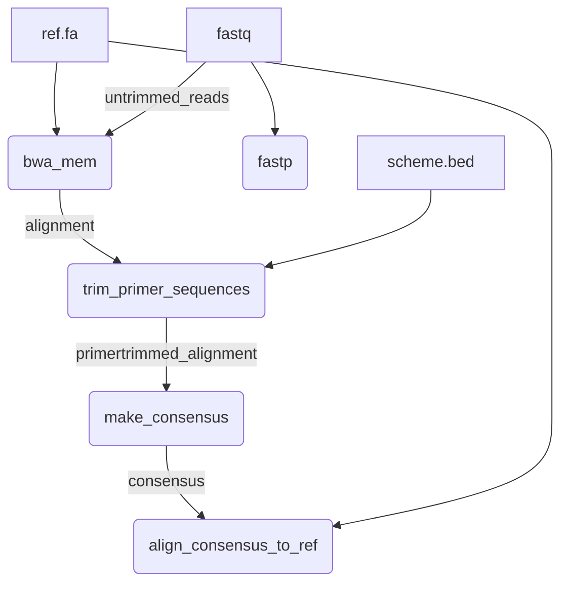

# 

This Nextflow pipeline monitors for mutations that may confer AMR in bacterial ribosomal repeats, specifically the 16S and 23S rRNA genes of *Treponema pallidum* subsp. *pallidum*, the etiological agent of syphilis. This workflow calls mutations in reference-guided assemblies of short paired-end reads sequenced from amplicon-based libraries. 

## Quick-Start

```
nextflow run BCCDC-PHL/riboscope \
  -r v0.9.9 \
  -profile conda \
  --cache ~/.conda/envs \
  --fastq_input /path/to/fastq_files \
  --ref /path/to/ref.fa \
  --bed /path/to/primer_scheme.bed \
  --search_seqs /path/to/query/seq/multi.fasta \
  --kraken2_db /path/to/kraken2/database \
  --bracken_db /path/to/bracken/database \
  --apply_qc \
  --outdir /path/to/output_dir
```
## Table of Contents
  [Quick-Start](#quick-start)<br>
  [Workflow](#workflow)<br>
  [Usage](#usage)<br>
  [Input](#input)<br>
  [Output](#output)<br>
  [Parameters](#parameters)<br>
  [References](#references)<br>

## Workflow


## Usage

The following command can be used to run the pipeline:

```
nextflow run BCCDC-PHL/riboscope \
  -profile conda \
  --cache ~/.conda/envs \
  --fastq_input /path/to/fastq_files \
  --ref /path/to/ref.fa \
  --bed /path/to/primer_scheme.bed \
  --search_seqs /path/to/query/seq/multi.fasta \
  --kraken2_db /path/to/kraken2/database \
  --bracken_db /path/to/bracken/database \
  --outdir /path/to/output_dir
```

To activate quality control (QC) filtering and generation of html report, run with the `--apply_qc` flag: 

```
nextflow run BCCDC-PHL/riboscope \
  -profile conda \
  --cache ~/.conda/envs \
  --fastq_input /path/to/fastq_files \
  --ref /path/to/ref.fa \
  --bed /path/to/primer_scheme.bed \
  --search_seqs /path/to/query/seq/multi.fasta \
  --kraken2_db /path/to/kraken2/database \
  --bracken_db /path/to/bracken/database \
  --apply_qc \
  --outdir /path/to/output_dir
```

By default, reads will be trimmed by fastp prior to alignment. To align the untrimmed reads instead, add the `--align_untrimmed_reads` parameter.
If this option is used, the pipeline will proceed as follows, using the original untrimmed reads as input for the bwa alignment process:



### Consensus Sequence

Consensus sequences are generated by applying SNPs called by LoFreq that are present at allele frequencies >= `min_vaf` to the reference sequence. Regions of the sequence covered by < `min_depth` in a sample are masked with 'N'. IUPAC bases encode REF + most dominant ALT allele, and do NOT encode for multiple ALT alleles at the same site. For example, at position 963 if there are 5A, 3T, 2G, the resulting IUPAC base will be W (A & T) not D (A & T & G). The parameters `min_iupac` and `max_iupac` control the range of frequencies of ALT alleles at which a SNP should be considered mixed. An ALT allele frequency < `min_iupac` = REF base in the consensus, an ALT allele frequency >= `max_iupac` = ALT base in the consensus sequence, and ALT allele frequencies between `min_iupac` and `max_iupac` result in IUPAC bases (REF + ALT). In the event of a tie in allele frequencies at multiallelic sites, the first in the VCF file is used. In the example of position 963 with 5A, 3T, 2G, if `min_iupac` is set to 0.1 (10%) and `max_iupac` is set to 0.9 (90%) the resulting consensus base will be W (A & T). To turn off IUPAC behaviour and generate a majority consensus, set `min_iupac` to the same value as `max_iupac` (ex. 50%), meaning allele frequencies below 0.5 will be the REF and those >= 0.5 will be the ALT. Alternatively, to reproduce default `bcftools consensus -s - -I bcftools.norm.vcf.gz` behaviour, set `min_iupac` to 0 and `max_iupac` to 0.5 (ALT allele frequencies < 0.5 will appear as IUPAC base (REF+ALT) and those >= 0.5 will be the dominant allele (ALT) in the consensus sequence). Note that LoFreq splits multiallelic sites into one ALT allele per row and does not produce genotype (GT) column with result per sample, both of which bcftools uses to call the consensus nucleotide (ex. A,T,G --> GT 1/2 --> T/G --> K). 

### Dehosting

Kraken2 and Bracken provide taxonomic classification and abundance estimation on samples before and after "dehosting". The pipeline does not align to host genome but instead uses pathogen inclusion by aligning reads to the target pathogen sequence and excluding any reads with bit set in the UNMAP flag (`samtools view -F4`). It is important to note that "other" reads in the `kraken2_summary` may be from the pathogen but at a higher taxonomic level. The number and percentage of pathogen reads is determined by an exact match, so you may obtain different results depending on the level of resolution you use (ex. 49% of reads may have been classified as "Treponema pallidum" but 90% are classified as "Treponema"). It is recommended to trial Kraken2 and select a taxon that encompasses the majority of reads for your organism of interest to an acceptable resolution. Therefore, the target taxon name chosen effectively determines the taxonomic level at the Kraken2 step. Due to how closely related *Treponema pallidum* subsp. *pallidum* is to other Treponema pallidum subspecies (TEN, TPE) the pipeline is designed to use Kraken2 results as a broad check for host or environmental contamination, then uses Bracken at taxonomy level of 'S1' (subspecies) to further resolve subspecies of Treponema pallidum to check specificty of amplification/ sequencing. Host reads (ex. *Homo sapiens*) are not classified to the subspecies level, which is why the Kraken2 report is used for an initial approximation of host, target pathogen, unclassified, and other reads. 

### Reporting Mutations According to Position in Genomic Feature(s)

Users may optionally adjust reported positions of mutations according to where they are located in a specified genomic feature by providing a [GFF3](https://www.ncbi.nlm.nih.gov/datasets/docs/v2/reference-docs/file-formats/annotation-files/about-ncbi-gff3/) file. Mutations are displayed relative to position in each genomic feature. The same mutation may appear in multiple features when there are overlapping features. Coordinates are reported in strand-aware manner. The original position along the reference sequence is found under "snv" when hovering over a mutation in the report, while "feature_snv" shows the position of the mutation relative to the start of a specific feature from a given organism. The genomic features as well as the position are controlled by the user via GFF3 file. For example, a mutation may be reported relative to the start of a <em>Treponema pallidum</em> 23S rRNA gene or relative to an <em>Escherichia coli</em> 23S rRNA gene by simply aligning this gene to the reference and specifying the start and end positions relative to the reference in the GFF3 file. Note that this process is not gap-aware. For example, the position of the mutation relative to the reference sequence (POS = 4718) is converted to the equivalent position in the E.coli 23S rRNA gene (FEATURE_POS = 2100) but does not account for gaps from the E.coli 23S:TPA reference sequence pairwise alignment (42 gaps before position 2100, since E.coli 23S rRNA gene is “stretched” across the ref sequence). This means it is reported as 2100 in E.coli 23S rRNA gene but is actually 2100-42 gaps = 2058. Here is what the entry might look like in the \*.feature.annotated.vcf VCF file for this example:
 
CHROM POS REF ALT AF  DP4 SAMPLE_ID FEATURE_NAME  FEATURE_STRAND  FEATURE_POS
NC_000919.1_ribo_rpt1 4718  A G 0.09  4730,7588,37,20 example_sample  ecoli_23S + 2100

### Quality Control

The `--apply_qc` parameter generates the `results_report.html` which reports SNPs across genomic features as well as QC results, aggregates results for all samples, summarizes QC (qc_summary.csv), and filters out SNPs from low quality samples or amplicons that did not pass the minimum count of unique sequences (see `--search_seqs`). There are a number of parameters that control QC pass/fail thresholds in the `nextflow.config` file. For example, the `--max_qc_flags` adjusts the maximum allowable number of "soft fail" QC flags allowable before sample is failed. Currently, samples instantly fail if no amplicons are detected, number of reads are insufficient (< min_map), or there is insufficient pathogen content detected (see `filter_qc.py`).

### Provenance

riboscope uses v1.3.0 of the nf-prov plugin with the legacy format. The inputs, outputs, command line ran, and process name of each task is recorded, along with workflow information such as pipeline version, commit hash, analysis start time, Nextflow session ID. Two processes exist for the sake of printing relevant provenance information (`pipeline_provenance` & `print_hashed_records`) like sha256 hashes of input raw sequencing read (FASTQ) files, as an alternative to producing and collating yml files within each process. This approach was taken to simplify code required and ensure script block is recorded dynamically. One caveat of this approach compared to aggregating provenance yaml files is that information is not grouped by sample, though this may be resolved through downstream parsing of provenance.json. 

## Input

| Input  | Parameter   |  Description   |  Mandatory  |
|:----|:-----|:-----|:-----|
| Paired-end sequencing reads |  `fastq_input`  | Absolute path to directory containing raw FASTQ reads to be analyzed. Riboscope accepts gzip compressed or uncompressed files (*.fastq.gz, *.fq.gz, *.fastq, *.fq).    |  true    |
|Reference genome | `ref` |  Reference genome used to align reads to during guided assembly    |  true    |
|BED file	 | `bed`  | Primer scheme BED file in the [6 column format](https://genome.ucsc.edu/FAQ/FAQformat.html#format1). Note that rows must be repeated for each gene copy (ex. 3 gene copies = same row 3 times)    |  true    |
|MultiFASTA of query sequences | `search_seqs`  | MultiFASTA file contain short sequences to query raw reads. Used to verify presence of expected gene copies.     |  true    |
|Bracken database | `bracken_db`  | Path to prebuilt bracken database (ex. 50, 75, 100-mers, etc) |  true    |
|Kraken2 database | `kraken2_db`  | Path to prebuilt kraken2 database (ex. standard_16gb) |  true    |
|GFF3 file| `gff`  | Path to the [GFF3](https://www.ncbi.nlm.nih.gov/datasets/docs/v2/reference-docs/file-formats/annotation-files/about-ncbi-gff3/) file containing features user would like to identify mutations in. If provided, mutations are reported according to feature coordinates. If no GFF3 provided, mutations are reported as default coordinates in reference sequence |  false    |


## Output

 Output  |  Description   |  Notes  |
|:----|:-----|:-----|
| \*_amplicon_coverage.{tsv,png} | Average depth of coverage for each amplicon in reference sequence |  All output files listed with wildcard \* are produced per sample in separate directories    |
| \*_{pre,post}_dehosting_kraken2.tsv | The final formatted Kraken2 report summarizing read classification by pathogen, host, and other |  -    |
| \*_kraken_report\_{pre,post}_dehosting.txt  | The raw Kraken2 report used as input for Bracken  |  -    |
| \*_bracken_output\_{pre,post}_dehosting.tsv  | The taxonomic classification of reads at level specified by user  |  -    |
| \*_consensus_masked_iupac.fasta | Consensus sequence of each sample, including masked regions below specified depth, mutations from \*.lofreq.variants.vcf filtered to include those >= minimum VAF (`--min_vaf`), and adjustable thresholds for multiallelic sites encoded by IUPAC ambiguous bases  |  `--min_iupac`: if vaf < min_iupac = ref in consensus while sites with alt alleles between min_iupac & max_iupac = mixed. `--max_iupac`: vaf that an alt is called in consensus. |
| \*_depths.tsv | Number of sequencing reads covering each position in the reference sequence |  none    |
| \*_fastp.csv | Trimming and filtering read statistics.  |  Uses `fastp --trim_poly_g --trim_poly_x`   |
| \*.expected.snps.vcf | Variant Call Format (VCF) file required by LoFreq to call indels   |  SNVs present at 1% used for recalibrating BQ according to GATK best practices, recommended by LoFreq for indel calling. See Jago et al. (2020) reference below.  |
| \*.lofreq.variants.vcf | Raw SNVs called above minimum depth and including indels |  pre-filtering 'raw' SNVs |
| \*.lofreq.formatted.vcf | Formatted VCF file with SNVs filtered to include those with allele frequency of at least minimum VAF |  tsv file filtered by `--min_vaf`   |
| \*.feature.annotated.vcf |  Final processed VCF file containing mutations >= minimum VAF and overlapping genomic features |  Controlled by `--gff` genomic features. See [Mutation coordinate system](#reporting-mutations-according-to-position-in-genomic-features) section |
| \*.mapped.primertrimmed.sorted.{bam,bai}| Sorted alignment of primer-trimmed reads to reference sequence & associated index file |  -    |
| \*_qualimap_alignment_qc.csv | Formatted alignment quality report including breadth of coverage statistics |  -    |
| \*_rrna_counts.csv | Number of hits for each query sequence in `--search_seqs` multifasta within forward and reverse raw sequencing read files of each sample. Used as a proxy to detect presence of same amplicons from different repeats by using query sequences unique to each amplicon |  -    |
| \*_samtools_stats_coverage_distribution.tsv |  Distribution of alignment depth per covered reference site from `samtools stats`  |  `^COV`    |
| \*_samtools_stats_insert_sizes.tsv | Total read pairs and their orientation (inward vs. outward) per insert fragment size  |  -    |
| \*_samtools_stats_summary.csv | Formatted read and mapping quality report |  -    |
| qc_summary.csv | Aggregated QC results summary for all samples in directory including QC pass/fail status | Only produced if either `--collect_outputs` or `--apply_qc` param is included |
| collected_samtools_stats_summary.csv | Formatted read and mapping quality report for all samples in `fastq_input` dir | Only produced if either `--collect_outputs` or `--apply_qc` param is included  |
| collected_qualimap_alignment_qc.csv | Alignment quality report including breadth of coverage statistics for all samples in run  | Only produced if either `--collect_outputs` or `--apply_qc` param is included  |
| collected_rrna_counts.csv | Collective results of "amplicon counts"/ query sequence hits from raw reads.  See \*_rrna_counts.csv for more details |  Only produced if either `--collect_outputs` or `--apply_qc` param is included |
| collected_lofreq.vcf | Collective mutation results for all samples in `--fastq_input` directory. Results are aggregated \*.feature.annotated.vcf files, produced by processing \*.lofreq.formatted.vcf files by `adjust_variant_coordinates.py` script.  |  Only produced if either `--collect_outputs` or `--apply_qc` param is included in command. Annotated with genomic feature(s) coordinates if `--gff` specified, else mutation coordinates remain the same (relative to reference sequence instead of genes/ features). |
| collected_fastp.csv | Aggregated read trimming and filtering read results of all samples in input directory  |  Only produced if either `--collect_outputs` or `--apply_qc` param is active   |
| collected_bracken.tsv | Collective  Bracken taxonomic classification of Kraken2 reported reads at specified taxonomic level (`--taxonomy_level`) for all samples *pre* and *post* dehosting |  Only produced if either `--collect_outputs` or `--apply_qc` param is included |
| collected_kraken2_summary.tsv  | Aggregated Kraken2 classification results summarized by user specified pathogen (see [Dehosting](#dehosting) section), host and unclassified reads per sample both *before* and *after* dehosting | Only produced if either `--collect_outputs` or `--apply_qc` param is included |

## Parameters

 
> Note: Pipeline parameters listed below are preceded by a double-dash -- (ex. `--fastq_input`) while Nextflow related parameters use single dashes (ex. `-profile`)

| Parameter  | Description   |  Required   |  Default  |
|:----|:-----|:-----|:-----|
|`fastq_input` | Absolute path to directory containing raw FASTQ reads to be analyzed. Riboscope accepts gzip compressed or uncompressed files (*.fastq.gz, *.fq.gz, *.fastq, *.fq).   | yes    |  none    |
|`outdir` | Absolute path to directory to write results to. | no    |  ./results    |
|`apply_qc` | Activate QC filtering of samples and generation of html results report  | no    |  off    |
|`ref` | Reference genome used to align reads to during guided assembly  | yes    |  none    |
|`bed` | Primer scheme BED file in the [6 column format](https://genome.ucsc.edu/FAQ/FAQformat.html#format1)   | yes    |  none    |
|`search_seqs` | MultiFASTA file contain short sequences to query raw reads. Used to verify presence of expected gene copies.   | yes    |  none    |
|`cache` | Directory to cache conda environments for future use.   | no    |  ./work/conda    |
|`align_untrimmed_reads` | Skips read trimming by fastp. Allows alignment of raw untrimmed reads using bwa. | no    |  off    |
|`min_depth` | Minimum number of reads covering a genomic position. | no    |  10    |
|`collect_outputs` | Summarize outputs of multiple samples into one. | no    |  off    |
|`collected_outputs_prefix` | Prefix to name multi-sample summary files with. | no    |  'collected'    |
|`min_vaf` | Minimum allowable variant allele frequency (VAF) to filter. This porportion is applied to lofreq VCF and resulting \*lofreq.formatted.vcf contains only SNPs present above this VAF. | no    |  0    |
|`gff` | Path to the [GFF3](https://www.ncbi.nlm.nih.gov/datasets/docs/v2/reference-docs/file-formats/annotation-files/about-ncbi-gff3/) file containing features user would like to identify mutations in. If provided, mutations are reported according to feature coordinates. If no GFF3 provided, mutations are reported as default coordinates in reference sequence. The reported features and mutation positions are dictated by the user in the GFF3 file. For example, a mutation may be reported relative to the start of a <em>Treponema pallidum</em> 23S rRNA gene or relative to an <em>Escherichia coli</em> 23S rRNA gene by simply aligning this gene to the reference and specifying the start and end positions in the GFF3 file.   | no    |  none    |
|`min_amplicon_count` | Minimum median query sequence counts to consider an amplicon as present  | no    |  300    |
|`min_pathogen` | Minimum percentage of reads classified as target pathogen in a sample | no    |  85.0    |
|`max_host` | Maximum percentage of host reads in a sample | no    |  5.0   |
|`min_q20_rate` | Minimum threshold for Q20 rate  | no    |  0.95    |
|`min_q30_rate` | Minimum threshold for Q30 rate  | no    |  0.85    |
|`min_mean_bq` | Minimum average base quality threshold  | no    |  30    |
|`min_mean_depth` | Minimum threshold for average depth  | no    |  100    |
|`min_mapped_paired` | Minimum threshold for number of reads that are mapped and paired | no    |  1000    |
|`min_percent_mapped` | Minimum threshold for percentage of mapped reads | no    |  0.8    |
|`min_mapped_reads` | Minimum threshold for number of mapped reads | no    |  100    |
|`min_mean_mq` | Minimum threshold for average mapping quality | no    |  50    |
|`min_10X_cov` | Minimum threshold for proportion of genome covered over 10X  | no    |  0.85    |
|`min_50X_cov` | Minimum threshold for proportion of genome covered over 50X  | no    |  0.85    |
|`max_secondary` | Maximum allowable number of secondary alignments  | no    |  0    |
|`min_pos_count` | Minimum allowable number of positive control query sequence counts for testing presence of amplicons  | no    |  100    |
|`max_qc_flags` | Maximum number of soft fail QC flags allowable before sample is failed  | no    |  5    |
|`qc_output` | Name or prefix of output file to write QC summary to  | no    |  'qc_summary'   |
|`html_template` | Path to html template to use while generating report  | no    |  ./assets/report_template.html    |
|`kraken2_db` | Path to prebuilt kraken2 database (ex. standard_16gb) | yes    |  none    |
|`bracken_db` | Path to prebuilt bracken database (ex. 50, 75, 100-mers, etc) | yes    |  none   |
|`taxonomy_level` | Taxonomy level used by Bracken (ex. subspecies = S1) | no    |  S1    |
|`read_length` | Length of sequencing reads used by Bracken | no    |  150    |
|`host_name` | Name of host used to parse Kraken2 results for taxonomic classification section of report and QC filtering (max_host) | no    |  Homo sapiens   |
|`pathogen_name` | Name of target pathogen used to parse Kraken2 results for taxonomic classification section of report and QC filtering (min_pathogen) | no    |  Treponema    |
|`reporting_vaf` | Minimum variant allele frequency in a given sample to report SNVs | no    |  0.9    |
|`reporting_sample_perc` | Minimum percentage of total successfully sequenced samples containing a given SNV | no    |  0.3    |

## References

1. Jago, M.J., Soley, J.K., Denisov, S. et al. High-throughput method characterizes hundreds of previously unknown antibiotic resistance mutations. Nat Commun 16, 780 (2025). https://doi.org/10.1038/s41467-025-56050-2
1. https://github.com/BCCDC-PHL/amplicon-consensus
