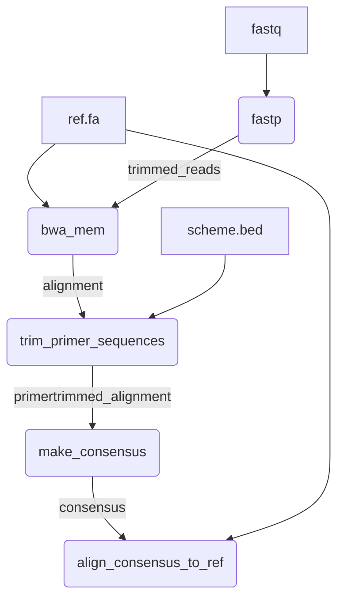
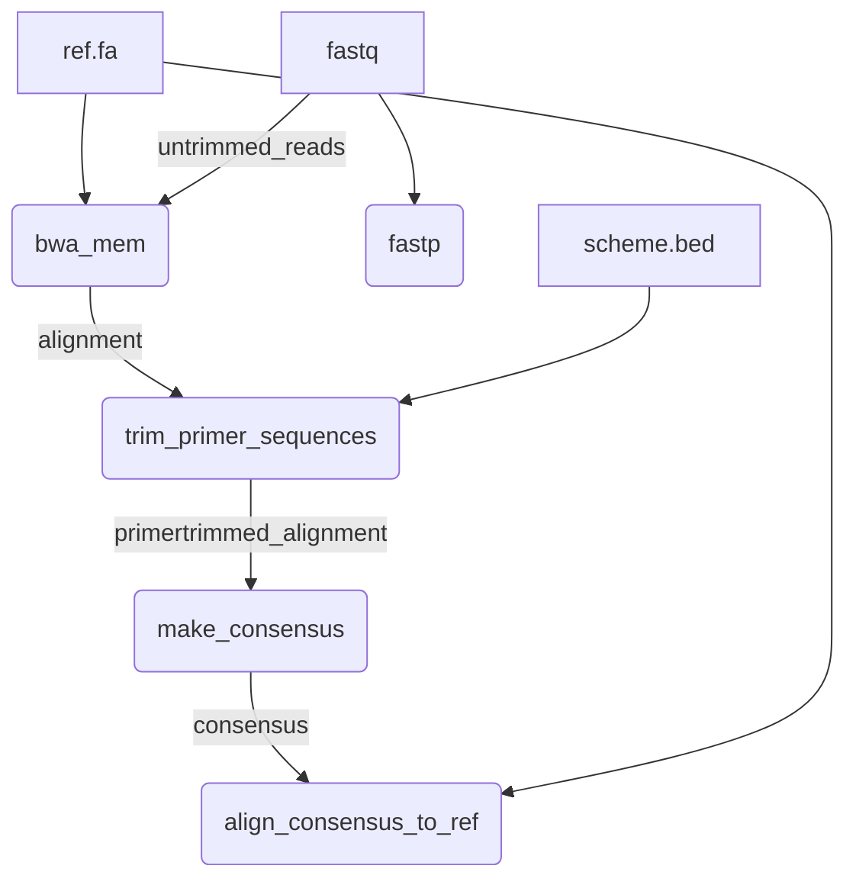

# 

This Nextflow pipeline monitors for mutations that may confer AMR in bacterial ribosomal repeats, specifically the 16S and 23S rRNA genes of *Treponema pallidum* subsp. *pallidum*, the etiological agent of syphilis. This workflow calls mutations in reference-guided assemblies of short paired-end reads sequenced from amplicon-based libraries. 

## Quick-Start

```
nextflow run BCCDC-PHL/riboscope \
  -profile conda \
  --cache ~/.conda/envs \
  --fastq_input /path/to/fastq_files \
  --ref /path/to/ref.fa \
  --bed /path/to/primer_scheme.bed \
  --search_seqs /path/to/query/seq/multi.fasta \
  --outdir /path/to/output_dir \
  --apply_qc
```
## Table of Contents
  [Overview](#riboscope)<br>
  [Quick-Start](#quick-start)<br>
  [Workflow](#workflow)<br>
  [Usage](#usage)<br>
  [Input](#input)<br>
  [Output](#output)<br>
  [Parameters](#parameters)<br>
  [References](#references)<br>

## Workflow



## Usage

The following command can be used to run the pipeline:

```
nextflow run BCCDC-PHL/riboscope \
  -profile conda \
  --cache ~/.conda/envs \
  --fastq_input /path/to/fastq_files \
  --ref /path/to/ref.fa \
  --bed /path/to/primer_scheme.bed \
  --search_seqs /path/to/query/seq/multi.fasta \
  --outdir /path/to/output_dir
```

By default, reads will be trimmed by fastp prior to alignment. To align the untrimmed reads instead, use the `--align_untrimmed_reads` parameter:

```
nextflow run BCCDC-PHL/riboscope \
  -profile conda \
  --cache ~/.conda/envs \
  --fastq_input /path/to/fastq_files \
  --ref /path/to/ref.fa \
  --bed /path/to/primer_scheme.bed \
  --search_seqs /path/to/query/seq/multi.fasta \
  --align_untrimmed_reads \
  --outdir /path/to/output_dir
```

If this option is used, the pipeline will proceed as follows, using the original untrimmed reads as input for the bwa alignment process:



To activate quality control (QC) filtering and generation of html report, run with the `--apply_qc` flag: 

```
nextflow run BCCDC-PHL/riboscope \
  -profile conda \
  --cache ~/.conda/envs \
  --fastq_input /path/to/fastq_files \
  --ref /path/to/ref.fa \
  --bed /path/to/primer_scheme.bed \
  --search_seqs /path/to/query/seq/multi.fasta \
  --outdir /path/to/output_dir \
  --apply_qc
```

### Consensus Sequence

Consensus sequences are generated by applying SNPs called by LoFreq that are present at allele frequencies >= `min_vaf` to the reference sequence. Regions of the sequence covered by < `min_depth` in a sample are masked with 'N'. IUPAC bases encode REF + most dominant ALT allele, and do NOT encode for multiple ALT alleles at the same site. For example, at position 963 if there are 5A, 3T, 2G, the resulting IUPAC base will be W (A & T) not D (A & T & G). The parameters `min_iupac` and `max_iupac` control the range of frequencies of ALT alleles at which a SNP should be considered mixed. An ALT allele frequency < `min_iupac` = REF base in the consensus, an ALT allele frequency >= `max_iupac` = ALT base in the consensus sequence, and ALT allele frequencies between `min_iupac` and `max_iupac` result in IUPAC bases (REF + ALT). In the event of a tie in allele frequencies at multiallelic sites, the first in the VCF file is used. In the example of position 963 with 5A, 3T, 2G, if `min_iupac` is set to 0.1 (10%) and `max_iupac` is set to 0.9 (90%) the resulting consensus base will be W (A & T). To turn off IUPAC behaviour and generate a majority consensus, set `min_iupac` to the same value as `max_iupac` (ex. 50%), meaning allele frequencies below 0.5 will be the REF and those >= 0.5 will be the ALT. Alternatively, to reproduce default `bcftools consensus -s - -I bcftools.norm.vcf.gz` behaviour, set `min_iupac` to 0 and `max_iupac` to 0.5 (ALT allele frequencies < 0.5 will appear as IUPAC base (REF+ALT) and those >= 0.5 will be the dominant allele (ALT) in the consensus sequence). Note that LoFreq splits multiallelic sites into one ALT allele per row and does not produce genotype (GT) column with result per sample, both of which bcftools uses to call the consensus nucleotide (ex. A,T,G --> GT 1/2 --> T/G --> K). 

### Dehosting

Kraken2 and Bracken provide taxonomic classification and abundance estimation on samples before and after "dehosting". The pipeline does not align to host genome but instead uses pathogen inclusion by aligning reads to the target pathogen sequence and excluding any reads with bit set in the UNMAP flag (`samtools view -F4`). It is important to note that "other" reads in the `kraken2_summary` may be from the pathogen but at a higher taxonomic level. The number and percentage of pathogen reads is determined by an exact match, so you may obtain different results depending on the level of resolution you use (ex. 49% of reads may have been classified as "Treponema pallidum" but 90% are classified as "Treponema"). It is recommended to trial Kraken2 and select a taxon that encompasses the majority of reads for your organism of interest to an acceptable resolution. Due to how closely related Treponema pallidum subsp. pallidum is to other Treponema pallidum subspecies (TEN, TPE) the pipeline is designed to use Kraken2 results as a broad check for host or environmental contamination, then uses Bracken at taxonomy level of 'S1' (subspecies) to further resolve subspecies of Treponema pallidum to check specificty of amplification/ sequencing. 

## Input

| Input  | Parameter   |  Description   |  Notes  |
|:----|:-----|:-----|:-----|
| Paired-end sequencing reads |  `fastq_input`  | Absolute path to directory containing raw FASTQ reads to be analyzed. Riboscope accepts gzip compressed or uncompressed files (*.fastq.gz, *.fq.gz, *.fastq, *.fq).    |  none    |
|Reference genome | `ref` |  Reference genome used to align reads to during guided assembly    |  none    |
|BED file	 | `bed`  | Primer scheme BED file in the [6 column format](https://genome.ucsc.edu/FAQ/FAQformat.html#format1)    |  none    |
|MultiFASTA of query sequences | `search_seqs`  | MultiFASTA file contain short sequences to query raw reads. Used to verify presence of expected gene copies.     |  none    |

## Output


## Parameters

| Parameter  | Description   |  Required   |  Default  |
|:----|:-----|:-----|:-----|
|`fastq_input` | Absolute path to directory containing raw FASTQ reads to be analyzed. Riboscope accepts gzip compressed or uncompressed files (*.fastq.gz, *.fq.gz, *.fastq, *.fq).   | yes    |  none    |
|`outdir` | Absolute path to directory to write results to. | no    |  ./results    |
|`ref` | Reference genome used to align reads to during guided assembly  | yes    |  none    |
|`bed` | Primer scheme BED file in the [6 column format](https://genome.ucsc.edu/FAQ/FAQformat.html#format1)   | yes    |  none    |
|`search_seqs` | MultiFASTA file contain short sequences to query raw reads. Used to verify presence of expected gene copies.   | yes    |  none    |
|`cache` | Directory to cache conda environments for future use.   | no    |  ./work/conda    |
|`align_untrimmed_reads` | Skips read trimming by fastp. Allows alignment of raw untrimmed reads using bwa. | no    |  off    |
|`min_depth` | Minimum number of reads covering a genomic position. | no    |  10    |
|`collect_outputs` | Summarize outputs of multiple samples into one. | no    |  off    |
|`collected_outputs_prefix` | Prefix to name multi-sample summary files with. | no    |  'collected'    |
|`min_vaf` | Minimum allowable variant allele frequency (VAF) to filter. This porportion is applied to lofreq VCF and resulting \*lofreq.formatted.vcf contains only SNPs present above this VAF. | no    |  0    |
|`apply_qc` | Activate QC filtering of samples and generation of html results report  | no    |  off    |
|`min_amplicon_count` | Minimum median query sequence counts to consider an amplicon as present  | no    |  300    |
|`min_q20_rate` | Minimum threshold for Q20 rate  | no    |  0.95    |
|`min_q30_rate` | Minimum threshold for Q30 rate  | no    |  0.85    |
|`min_mean_bq` | Minimum average base quality threshold  | no    |  30    |
|`min_mean_depth` | Minimum threshold for average depth  | no    |  100    |
|`min_mapped_paired` | Minimum threshold for number of reads that are mapped and paired | no    |  1000    |
|`min_percent_mapped` | Minimum threshold for percentage of mapped reads | no    |  0.8    |
|`min_mapped_reads` | Minimum threshold for number of mapped reads | no    |  100    |
|`min_mean_mq` | Minimum threshold for average mapping quality | no    |  50    |
|`min_10X_cov` | Minimum threshold for proportion of genome covered over 10X  | no    |  0.85    |
|`min_50X_cov` | Minimum threshold for proportion of genome covered over 50X  | no    |  0.85    |
|`max_secondary` | Maximum allowable number of secondary alignments  | no    |  0    |
|`min_pos_count` | Minimum allowable number of positive control query sequence counts for testing presence of amplicons  | no    |  100    |
|`max_qc_flags` | Maximum number of soft fail QC flags allowable before sample is failed  | no    |  5    |
|`qc_output` | Name or prefix of output file to write QC summary to  | no    |  'qc_summary'   |
|`html_template` | Activate QC filtering of samples and generation of html results report  | no    |  ./assets/report_template.html    |

## References

1. Jago, M.J., Soley, J.K., Denisov, S. et al. High-throughput method characterizes hundreds of previously unknown antibiotic resistance mutations. Nat Commun 16, 780 (2025). https://doi.org/10.1038/s41467-025-56050-2
1. https://github.com/BCCDC-PHL/amplicon-consensus
