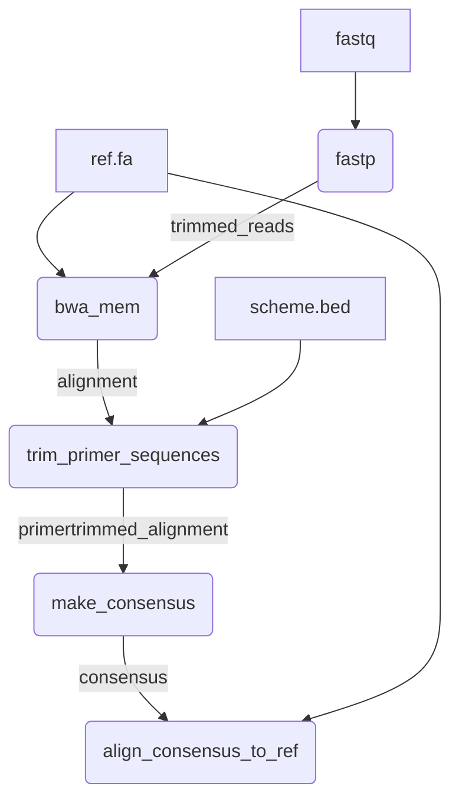
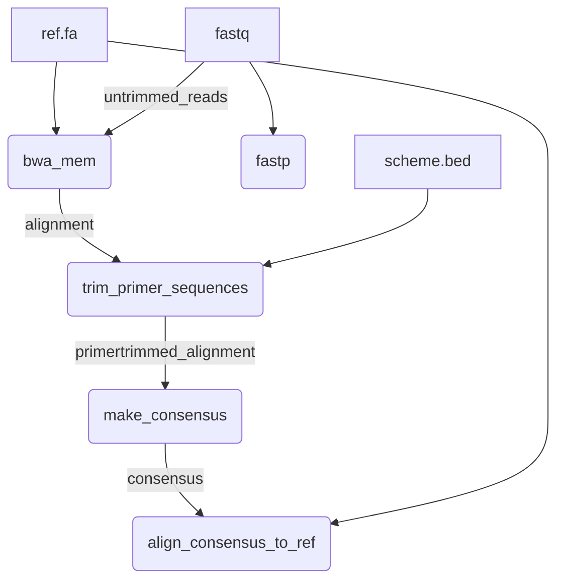

# riboscope

This Nextflow pipeline monitors for mutations that may confer AMR in bacterial ribosomal repeats, specifically the 16S and 23S rRNA genes of *Treponema pallidum* subsp. *pallidum*, the etiological agent of syphilis. This workflow calls mutations in reference-guided assemblies of short paired-end reads sequenced from amplicon-based libraries. 

## Quick-Start

```
nextflow run BCCDC-PHL/riboscope \
  -profile conda \
  --cache ~/.conda/envs \
  --fastq_input /path/to/fastq_files \
  --ref /path/to/ref.fa \
  --bed /path/to/primer_scheme.bed \
  --outdir /path/to/output_dir
```
## Table of Contents
  [Overview](#riboscope)<br>
  [Quick-Start](#quick-start)<br>
  [Workflow](#workflow)<br>
  [Usage](#usage)<br>
  [Input](#input)<br>
  [Output](#output)<br>
  [Parameters](#parameters)<br>
  [References](#references)<br>

## Workflow



## Usage

The following command can be used to run the pipeline:

```
nextflow run BCCDC-PHL/amplicon-consensus \
  -profile conda \
  --cache ~/.conda/envs \
  --fastq_input /path/to/fastq_files \
  --ref /path/to/ref.fa \
  --bed /path/to/primer_scheme.bed \
  --outdir /path/to/output_dir
```

By default, reads will be trimmed by fastp prior to alignment. To align the untrimmed reads instead, use the `--align_untrimmed_reads` parameter:

```
nextflow run BCCDC-PHL/amplicon-consensus \
  -profile conda \
  --cache ~/.conda/envs \
  --fastq_input /path/to/fastq_files \
  --ref /path/to/ref.fa \
  --bed /path/to/primer_scheme.bed \
  --align_untrimmed_reads \
  --outdir /path/to/output_dir
```

If this option is used, the pipeline will proceed as follows, using the original untrimmed reads as input for the bwa alignment process:




## Input


## Output


## Parameters


## References

1. Jago, M.J., Soley, J.K., Denisov, S. et al. High-throughput method characterizes hundreds of previously unknown antibiotic resistance mutations. Nat Commun 16, 780 (2025). https://doi.org/10.1038/s41467-025-56050-2
1. https://github.com/BCCDC-PHL/amplicon-consensus
